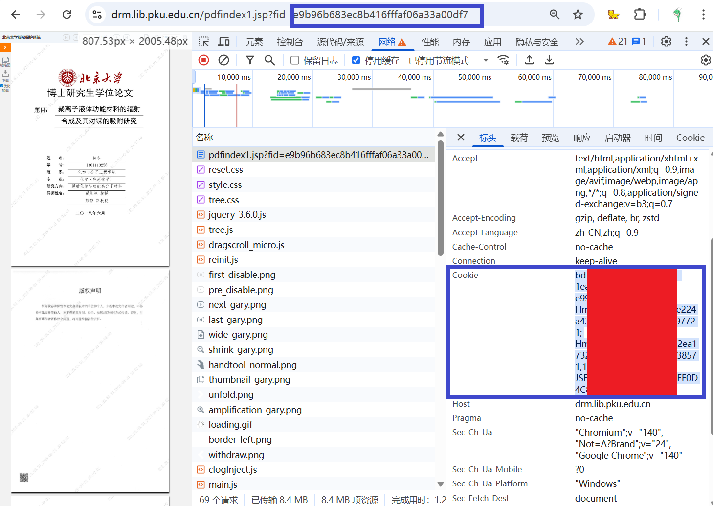

<h1 align="center">
北京大学学位论文数据库下载器
</h1>

[北京大学学位论文数据库](https://thesis.lib.pku.edu.cn/)电子版加载十分缓慢，造成阅读困难。以提升学习效率为目的，开发本工具用于提前下载为PDF格式。使用本工具请注意遵守北京大学学位论文数据库和著作权保护的相关要求。

### 使用方法

登录北京大学学位论文数据库，获取登录信息的Cookie和所需要学位论文的FID

- Cookie：登陆平台后打开检查-网络，随便找一个请求，在标头中找到请求标头-Cookie，复制值
- FID：进入论文阅读页面后显示在网址中

